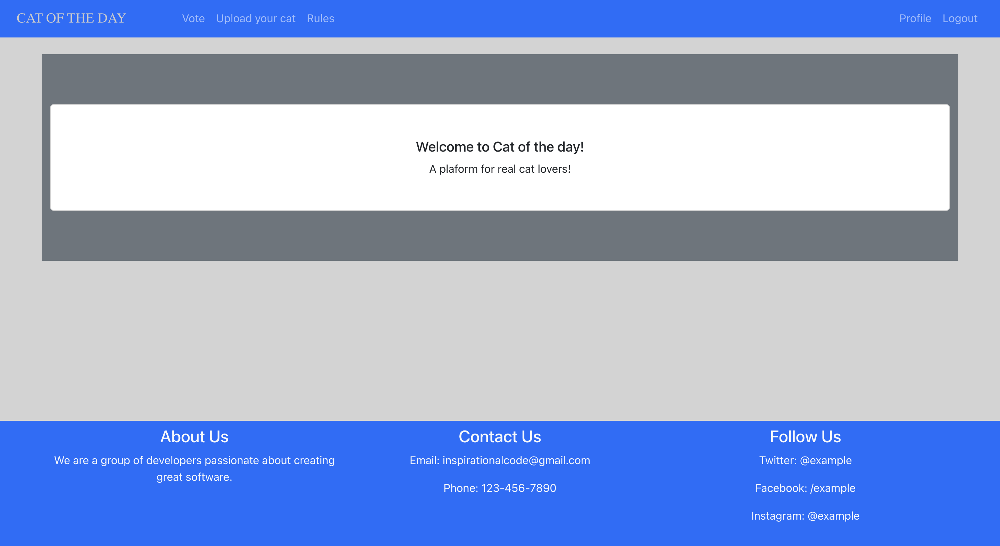
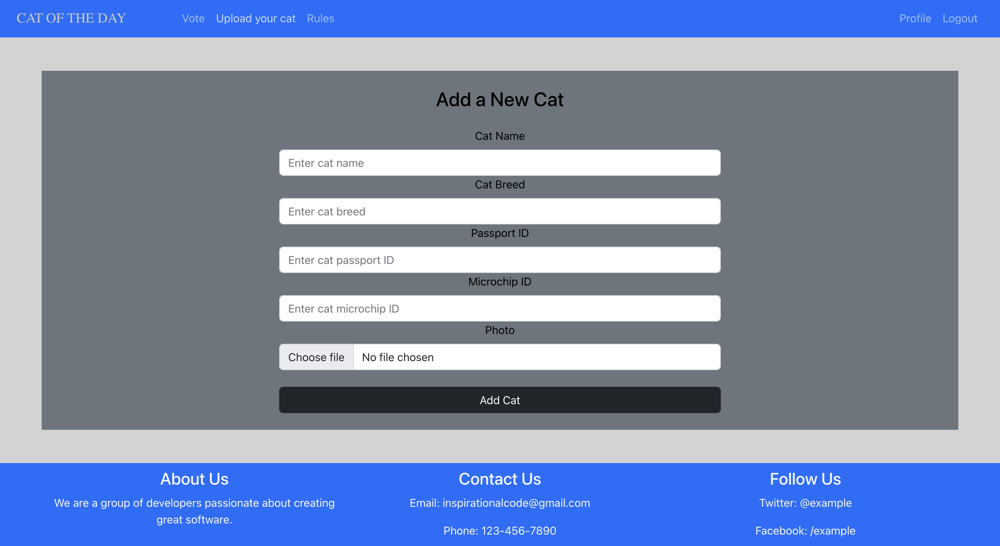
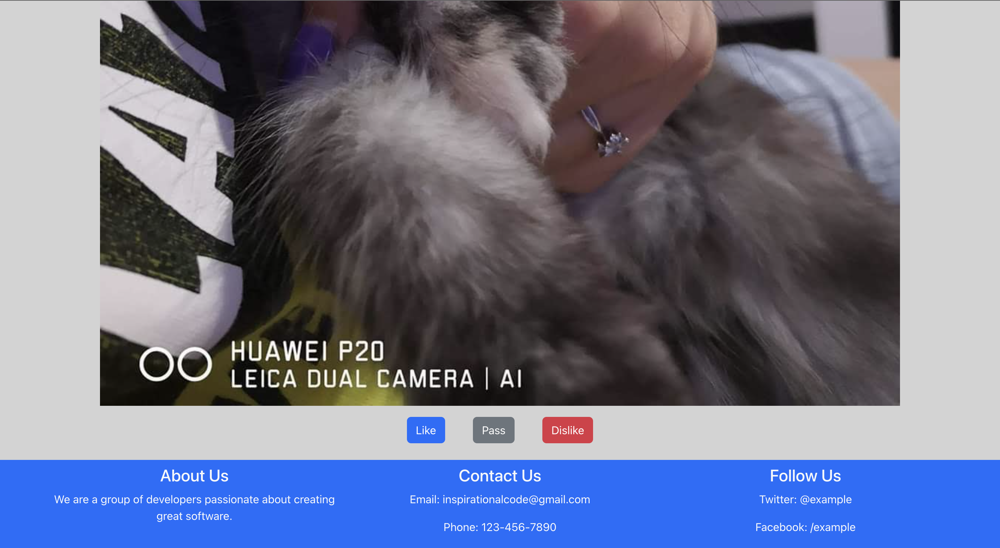

# CAT-OF-THE-DAY-FRONT-END
Webapp developed using React.js. A social media to post images of your cat. A user can post,like,dislike the images(of cats) posted by other users.
Deployed on https://yellow-moss-088559303.2.azurestaticapps.net

The backend repo is https://github.com/DamyanBG/cat-of-the-day-flask-api

URL of Deployed backend : https://cat-of-the-day-back-end.azurewebsites.net/


## Screenshots






## Run Locally

Clone the project

```bash
  git clone https://github.com/DamyanBG/cat-of-the-day-front-end.git
```

Go to the project directory

```bash
  cd cat-of-the-day-front-end
```

Install dependencies

```bash
  npm install
```

Start the server

```bash
  npm run start
```

## Deployment

To deploy this project run

```bash
  npm run deploy
```


## Tech Stack

**Client:** React, Bootstrap

**Server:** Flask


## License

[](https://choosealicense.com/licenses/mit/)
